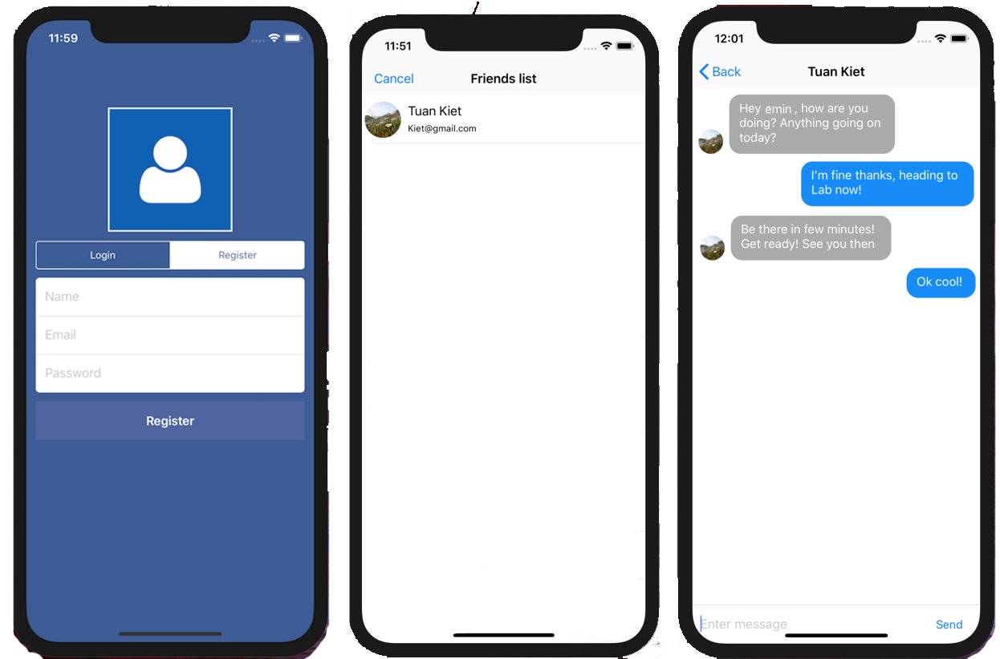

# Quick Chat for iOS

Mobile Messenger for iOS is a real time chat app written in Swift 5 using Firebase.

Mobile Messenger  allows to send and receive text messages, photos & location.

<h3 align="center">

</h3>

# Compatibility

This project is written in Swift 5.0 and requires Xcode 11.0 to build and run.

Mobile Messenger for iOS is compatible with iOS 13.0+.

# Author

* [EMIN MUGLA] twitter/eminmugla

# License

Copyright 2020 EMIN MUGLA

Licensed under MIT License: https://opensource.org/licenses/MIT
